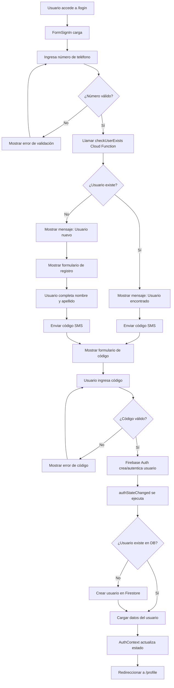
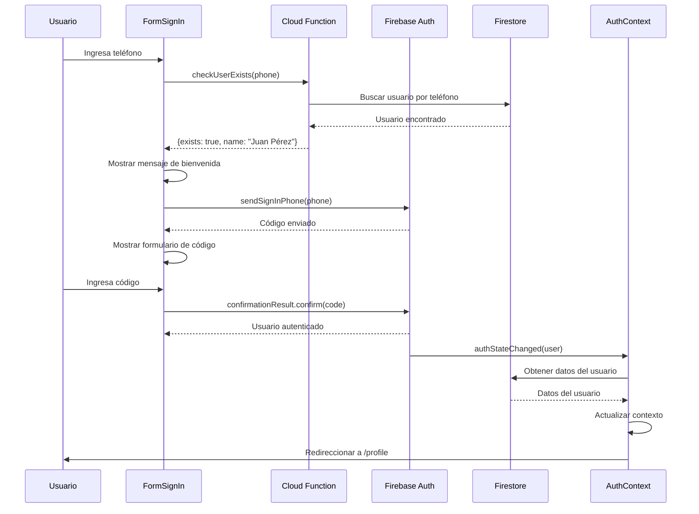
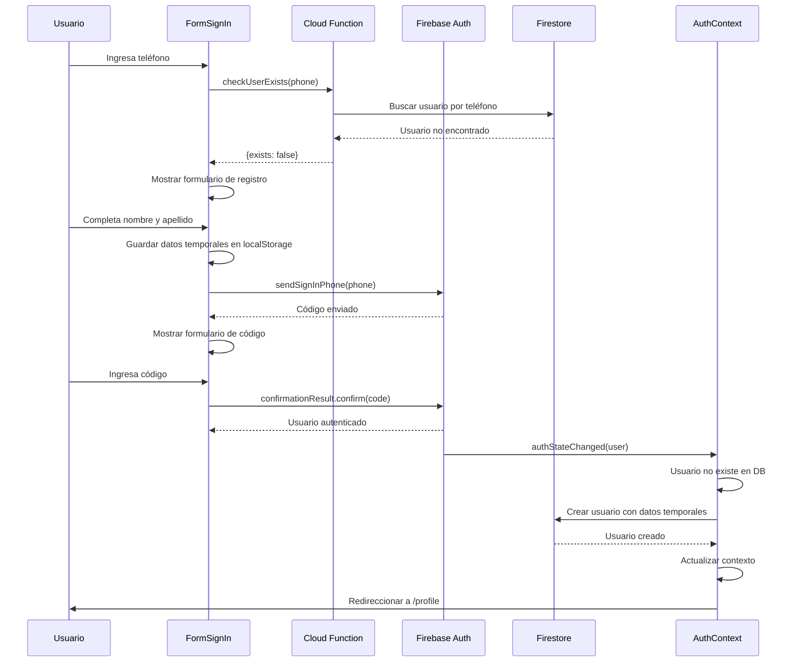
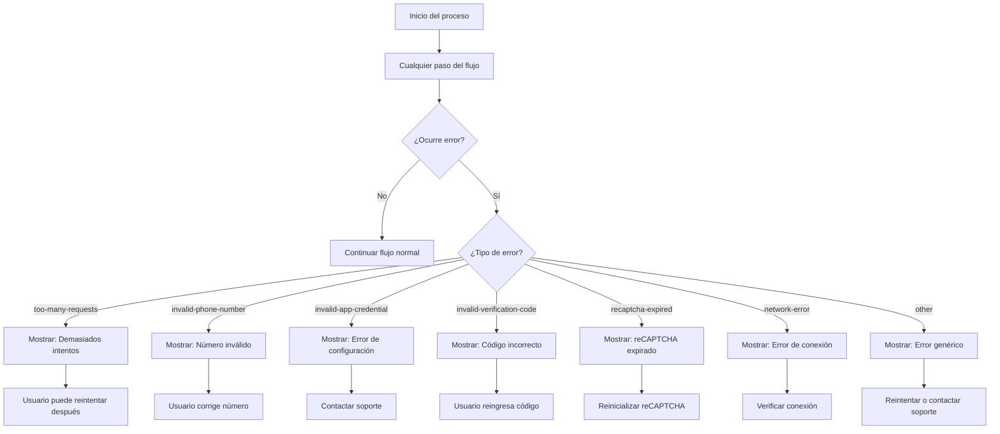
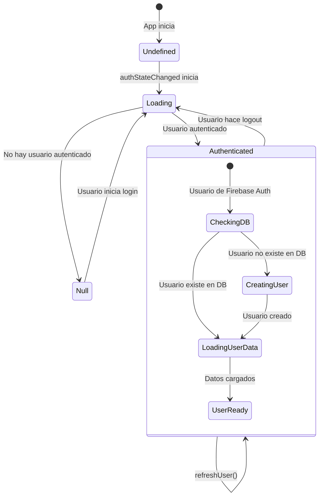
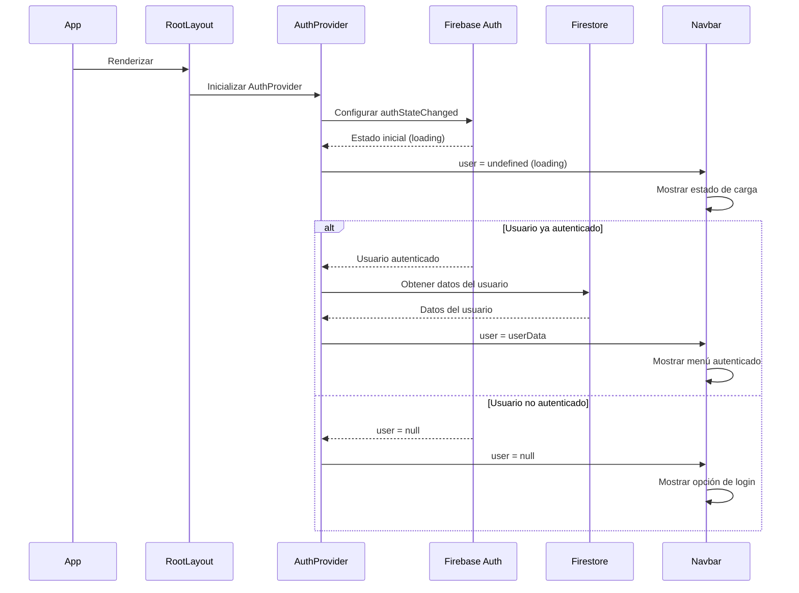

# Diagramas de Flujo de Login - BajaRent

Este documento contiene los diagramas de los diferentes flujos de autenticación que necesitamos probar en la aplicación BajaRent.

## 1. Flujo Principal de Login



## 2. Flujo de Usuario Existente



## 3. Flujo de Usuario Nuevo



## 4. Flujo de Manejo de Errores



## 5. Flujo de Estados del AuthContext



## 6. Flujo de Navegación y Protección de Rutas

```mermaid
flowchart TD
    A[Usuario navega a ruta] --> B{¿Ruta protegida?}
    B -->|No| C[Mostrar contenido público]
    B -->|Sí| D[PrivatePage HOC verifica auth]
    D --> E{¿Usuario autenticado?}
    E -->|Sí| F[Mostrar contenido protegido]
    E -->|No| G[Redireccionar a /login]
    G --> H[Proceso de login]
    H --> I[Login exitoso]
    I --> J[Redireccionar a ruta original]

    state Protegidas {
        /profile
        /my-rents
        /orders
        /rent-now
    }

    state Públicas {
        /
        /login
        /privacidad
        /[shop]
    }
```

## 7. Flujo de Inicialización de la App



---

## Casos de Prueba a Implementar

Basándose en estos diagramas, necesitamos crear pruebas para:

1. **Pruebas Unitarias:**

   - checkUserExists Cloud Function
   - Funciones de autenticación (sendSignInPhone, onSendCode)
   - AuthContext hooks y providers
   - Validaciones de formularios

2. **Pruebas de Integración:**

   - Flujo completo de usuario existente
   - Flujo completo de usuario nuevo
   - Manejo de errores de Firebase
   - Persistencia de datos temporales

3. **Pruebas E2E:**

   - Navegación entre estados del formulario
   - Protección de rutas
   - Experiencia completa de usuario
   - Casos de error y recuperación

4. **Pruebas de Componentes:**
   - FormSignIn con diferentes estados
   - PrivatePage HOC
   - AuthContext Provider
   - Formularios individuales

¿Te gustaría que modifique alguno de estos diagramas o agregar algún flujo específico antes de proceder con la implementación de las pruebas?
